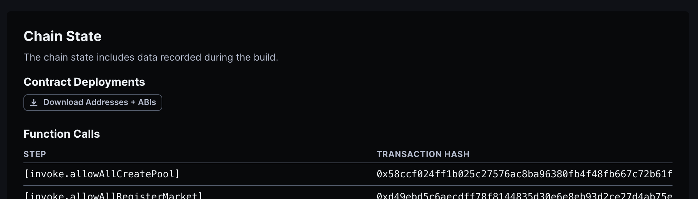

# Kwenta Synthetix Deployments

This the Kwenta GitOps repo for deployment of the [Synthetix](https://www.github.com/synthetixio/synthetix-v3) protocol.

The following section is the Synthetix Guide to deployment, for Kwenta specific information, jump straight to [Kwenta Deployment Notes](#kwenta-deployment-notes).

## Deployment Guide

- Run `yarn cannon setup` and ensure you have a reliable IPFS url for publishing.

### Specify Upgrade

- After [publishing any new versions of the provisioned packages](https://github.com/synthetixio/synthetix-v3#deployment-guide) (`oracle-manager`, `synthetix` and `spot-market`), bump the versions throughout the cannonfiles to match.
- Add new settings and invoke actions as necessary.
- Increment the version number and update the values in the network-specific omnibus cannonfiles as desired. The main version should match synthetix version, and if it a configuration change on the same version use a dash.
  Version: 3.3.5
  Version with config changes: 3.3.5-1

### Execute Upgrade

Conduct the following process for each network:

- Perform a dry-run and confirm that the actions that would be executed by Cannon are expected:

  ```sh
  yarn cannon build omnibus-base-sepolia-andromeda.toml \
    --dry-run \
    --upgrade-from synthetix-omnibus:latest@andromeda \
    --chain-id 84532 \
    --provider-url https://base-sepolia.infura.io/v3/$INFURA_API_KEY
  ```

- Remove the dry-run option to execute the upgrade:

  ```sh
  yarn cannon build omnibus-base-sepolia-andromeda.toml \
    --upgrade-from synthetix-omnibus:latest@andromeda \
    --private-key $TESTNET_DEPLOYER_PRIVATE_KEY \
    --provider-url https://base-sepolia.infura.io/v3/$INFURA_API_KEY
  ```

- After this you can run the dry-run command again (without upgrade-from), and should see no changes

  ```sh
  yarn cannon build omnibus-base-sepolia-andromeda.toml \
    --dry-run \
    --chain-id 84532 \
    --provider-url https://base-sepolia.infura.io/v3/$INFURA_API_KEY
  ```

_The --provider-url and --private-key parameters are unnecessary if using [Frame](https://frame.sh/)_

### Finalize Release

- If you've updated the provisioned packages, verify your new contracts on Etherscan:

  ```sh
    yarn cannon verify synthetix-omnibus:3.3.5-1@andromeda --chain-id 84531 --api-key $ETHERSCAN_API_KEY
  ```

- Publish your new packages on the Cannon registry:

  ```sh
  yarn cannon publish synthetix-omnibus:3.3.5-1@andromeda \
      --chain-id 84531 \
      --private-key $MAINNET_DEPLOYER_PRIVATE_KEY \
      --tags latest,3 \
      --include-provisioned
  ```

  If you use frame:
  (_The --private-key parameter is unnecessary if using [Frame](https://frame.sh/)_)

- Commit and merge the change to this repository.
- Run the [**Export ABIs** action](https://github.com/Synthetixio/v3-abi-exporter/actions/workflows/main.yml) in the `v3-abi-exporter` repository.

## Fork-testing locally

Example based on `omnibus-base-sepolia-andromeda.toml`

**IMPORTANT** Restart Anvil node and apply upgrades after each full test suite execution because of the global system state change, which affects things like global collateral limits

1. Build locally with --dry-run

   ```sh
   yarn cannon build omnibus-base-sepolia-andromeda.toml \
     --dry-run \
     --upgrade-from synthetix-omnibus:latest@andromeda \
     --chain-id 84532 \
     --provider-url https://sepolia.base.org \
       | tee ./e2e/cannon-build.log
   ```

   or

   ```sh
   yarn build:andromeda
   ```

2. Fetch deployments and store as JSON files

   ```sh
   yarn fetch-deployments
   ```

3. Run local Anvil node for the required network.

   ```sh
   yarn cannon build omnibus-base-sepolia-andromeda.toml \
      --port 8545 \
      --keep-alive \
      --dry-run \
      --upgrade-from synthetix-omnibus:latest@andromeda \
      --chain-id 84532 \
      --provider-url https://sepolia.base.org
   ```

   or

   ```sh
   yarn start:andromeda
   ```

4. Execute tests
   ```sh
   DEBUG='e2e:*' mocha e2e/tests/omnibus-base-sepolia-andromeda.toml/*.e2e.js
   ```
   or
   ```sh
   yarn test:base-sepolia
   ```

# Kwenta Deployment Notes

## Cannon Dictionary

### CLI

#### Commands

1. **run** - Instantly loads cannon packages in standalone contexts, allowing for quick testing or deployment of blockchain environments. It supports various global options and package-specific settings for customized operation.

2. **build** - Constructs a package from a Cannonfile, enabling the creation and configuration of blockchain environments based on predefined settings. It includes options for network interaction, artifact rebuilding, and deployment adjustments.

3. **verify** - Facilitates the verification of a cannon package on Etherscan, ensuring that the package's code matches a deployed contract on the blockchain. It requires specific details like package reference and API key for successful verification.

4. **alter** - Offers the capability to modify cannon packages outside the standard build process, providing commands for updating package details or states post-deployment. It is useful for package management and version control.

5. **fetch** - Retrieves cannon package data from an IPFS hash, storing it in the local registry. This command is essential for importing and utilizing packages distributed through IPFS.

6. **pin** - Allows uploading cannon package data to a remote registry via an IPFS hash, facilitating package sharing and distribution across different environments or users.

7. **publish** - Publishes a Cannon package to the registry, making it accessible for deployment or use by others. It includes options for specifying deployment parameters and registry details.

8. **register** - Registers a Cannon package on the main registry, ensuring it's officially listed and available for use within the Cannon ecosystem. It's a critical step for package dissemination and accessibility.

9. **inspect** - Provides detailed information about a Cannon package, including its configurations, deployments, and contract details. This command is vital for understanding package contents and deployment specifics.

10. **prune** - Cleans the cannon storage of excessive or transient build files, helping maintain an organized and efficient development environment by removing outdated or unnecessary files.

11. **trace** - Enables a full stack trace for a transaction hash or explicit transaction call, offering deep insights into transaction execution and potential issues within the blockchain environment.

12. **decode** - Decodes transaction data using the ABIs of a given Cannon package, aiding in the interpretation and analysis of blockchain transactions related to specific contracts or operations.

13. **test** - Runs forge tests on a cannon deployment, allowing for comprehensive testing of blockchain environments and smart contracts within a simulated or forked network.

14. **interact** - Initiates an interactive terminal against a set of active cannon deployments, facilitating direct interaction and testing of deployed contracts and environments.

15. **setup** - Initializes cannon settings file, setting up the necessary configuration for Cannon tooling and deployment processes.

16. **clean** - Deletes package cache directories, clearing temporary or cached files to ensure a clean development environment.

17. **plugin** - Manages Cannon plug-in modules, allowing for the addition, removal, and listing of plugins that extend or enhance Cannon's functionality.

### Builder

#### Deployment & Invocation Steps

Each step in the process involves specific configurations and purposes. Below are detailed descriptions for key operations:

##### Deploy

- **Purpose**: Deploys a contract if it hasn't been previously deployed. For already deployed contracts, it re-exports deployment options.
- **Schema**: Includes artifact name, deployment options (such as `highlight`, `create2`, `from`, etc.), constructor args, and dependencies.

##### Invoke

- **Purpose**: Invokes contract functions. It is designed for both transactional and read-only calls.
- **Schema**: Targets the contract to call, specifies the function and its arguments, and includes additional options like ABI, `from` address, value, and overrides.

##### Pull

- **Purpose**: Imports package data from a source, making contract addresses and other deployment output available for subsequent operations.
- **Schema**: Defines the source package and additional parameters like `chainId`, preset, and dependencies.

##### Clone

- **Purpose**: Provisions a new instance of a package, allowing the reuse of contracts and configurations in a new deployment.
- **Schema**: Specifies the source package, target chain ID, presets, and variable settings to initialize the Cannonfile with specific configurations.

##### Router

- **Purpose**: Generates a contract that proxies calls to multiple contracts, utilizing a router mechanism.
- **Schema**: Lists contracts involved and provides options for the `from` address, salt, and dependencies.

##### Var

- **Purpose**: Sets or overrides variables for use in the Cannonfile, supporting settings customization and dynamic configuration.
- **Schema**: Allows setting default values, descriptions, and dependent operations.

#### Configuration Schemas

Each operation is defined by a schema that validates and describes the required and optional fields. These schemas include:

- **argtype**: Defines the types for arguments, supporting strings, numbers, booleans, arrays, and records.
- **targetSchema**: Validates target addresses or contract names, ensuring compatibility with Ethereum address formats and naming conventions.
- **deploySchema, pullSchema, invokeSchema, cloneSchema, routerSchema, varSchema**: Specific schemas for each operation, detailing the structure and requirements for deployment and interaction steps.

#### Additional Notes

- Regular expressions are utilized to validate formats such as interpolated strings, step names, package versions, and artifact paths.
- The configuration allows for complex deployment scenarios, including conditional deployments, chain-specific operations, and dependency management.

#### Examples and Use Cases

Each schema and operation can be customized to fit various deployment and interaction patterns. Examples include deploying proxy contracts, interacting with deployed contracts to call functions or read state, and importing or cloning packages for modular and reusable deployments.

## Full Deployment Process

The following steps were used to deploy a forked "Kwenta" version of the protocol:

1. Copied `omnibus-base-goerli-competition.toml` into a new file `kwenta-omnibus-base-goerli-competition.toml`
   - Note that this version was chosen for copying, because it was used for a testnet competition on Base Goerli, and hence was best suited to deploying everything needed for a successful test deployment.
2. Make critical changes to the `.toml` cannonfile:
   1. Update the name of the of the deployment to `kwenta-synthetix-omnibus` instead of `synthetix-omnibus` - a new name is needed so we can separate our system in the registry from the one synthetix have already deployed and are managing.
   2. Update `setting.target_preset` to a new value just for our system (TODO: check why I did this & if it is really necessary).
   3. Update `setting.salt` to a unique value. This is needed to avoid a collision with the already deployed system, as use of CREATE2 will cause the same addresses to be generated, without a unique salt.
   4. Update the various `owner` settings to the chosen owner for the system. Without this change, it will not be possible to administrate the system. The following settings needs updating with this change:
      - `setting.owner`
      - `setting.pool_owner`
      - `setting.ccip_router` - normally this would be the [Cross Chain Interoperability Protocol Router](https://chain.link/cross-chain), but for testing purposes we will set it as the system owner here.
   5. Update `setting.deployer` address to the chosen deployer address. Without this change the deployment will fail. I used the same `owner` and `deployer` for simplicity (though in production it may be wise to use different addresses for security reasons)
   6. I removed `invoke.unapprove_wrongfully_deployed_snx_pool` as this was not relevant to our system.
3. Run a dry-run of the deployment to ensure it will be successful before executing against the actual chain:

```bash
cannon build kwenta-base-goerli-competition.toml --provider-url <BASE_GOERLI_RPC_URL> --private-key <DEPLOYER_PRIVATE_KEY> --dry-run
```

- `<BASE_GOERLI_RPC_URL> ` should be an RPC url for an eth node on the Base Goerli network.
- `<DEPLOYER_PRIVATE_KEY>` should be the private key for the EOA you want to deploy the system from. I used the Kwenta Testnet Admin (address: `0xC2ecD777d06FFDF8B3179286BEabF52B67E9d991`).
- This is the step to try and debug any issues with the deployment before using real ETH.

4. Send a chunky amount of ETH (it cost me 0.17 ETH, but send extra!) to the deployment address. Gas costs are volatile and you don't want to get caught with a mid-deployment failure. A semi-deployed/configured system is hard to fix! The Synthetix system is expensive to deploy. It is large and consists of many different modules and proxies. In theory cannon provides functionality for recovering a deployment that failed mid-way, in practice I was not able to get this to work.
5. Now you are ready for the real deal! Use this command to actually deploy the system 🔥 🚀 💫 (simply remove the `--dry-run` flag):

```bash
cannon build kwenta-base-goerli-competition.toml --provider-url <BASE_GOERLI_RPC_URL> --private-key <DEPLOYER_PRIVATE_KEY>
```

5. Now verify ✅ the system on etherscan with the following command:

```bash
cannon verify kwenta-synthetix-omnibus-test-3:3.3.3-dev.e141cd8c --chain-id 84531 --api-key <ETHERSCAN_API_KEY>
```

- `<ETHERSCAN_API_KEY>` for everyone on Base Goerli is: `PLACEHOLDER_STRING`
- `kwenta-synthetix-omnibus-test-3:3.3.3-dev.e141cd8c` is comprised of two parts:
  - `kwenta-synthetix-omnibus-test-3` - defined as the name in the cannonfile.
  - `3.3.3-dev.e141cd8c` - the version defined in the cannonfile.
- Awesome, your contracts should be verified now! 🥳

6. The final step - register your IPFS deployment on the cannon registry! This will allow you to view your contracts on [the online registry](https://usecannon.com/packages). It will show you loads of useful information about your contracts, let you people download the ABIs and contract addresses, and provide a UI for interacting with the contracts (etherscan won't work with the router-proxy-architecture used in synthetix).
   1. To complete this step you need some mainnet ETH. Send some to the EOA on mainnet you want to use for the registry transaction.
   2. Execute the following command:

```bash
cannon publish kwenta-synthetix-omnibus-test-3:3.3.3-dev.e141cd8c --chain-id 84531 --private-key <KEY_THAT_HAS_ETH_ON_MAINNET>
```

- For those interested, this process writes data to the [CannonRegistry contract](https://etherscan.io/address/0xd442Dc2Ac1f3cA1C86C8329246e47Ca0C91D0471#code) on Ethereum mainnet. This is actually just the implementation of contract, it is upgradeable and has a proxy. You can [see the code for the whole system here](https://github.com/usecannon/cannon/tree/main/packages/registry) and specifically [the code for the CannonRegistry contract here](https://github.com/usecannon/cannon/blob/main/packages/registry/contracts/CannonRegistry.sol).

If you made it this far - congratulations! You just deployed synthetix! 🎉

But... we are not finished with smart contract tasks yet from Kwenta's perspective. We still need to do step 7:

7. Deploy `smart-margin-v3` - for that you will need [this repo](https://github.com/Kwenta/smart-margin-v3) - you can use the [Deploy.s.sol script](https://github.com/Kwenta/smart-margin-v3/blob/main/script/Deploy.s.sol) with forge.

## Integrating the front-end the Kwenta deployment

The following steps needed completing once the smart contracts were deployed:

1. Get the ABIs from the [cannon registry site](https://usecannon.com/packages). Got to the deployment page - e.g. [like this one](https://usecannon.com/packages/kwenta-synthetix-omnibus-test-3/3.3.3-dev.e141cd8c/84531-main), scroll down and click the download addresses + ABIs button.
   
2. Update the FE with all the new addresses, including:

- Addresses for all synths - e.g. `sUSD`, `sBTC`, `sETH`, `sLINK`, `sOP` etc.
- MarginEngine and depending on the FE setup, the new TrustMulticallForwarder address if applicable.
- A subgraph needs deploying for everything to work fully, however without doing that, the following shortcut can be helpful:
  - Hardcode all settlement strategies to `0`.
- PerpsV3MarketProxy
- AccountProxy

3. Other stuff I am not aware of as a measly smart-contract engineer.

## Interacting with Kwenta Synthetix V3 Base Goerli

Kwenta has now deployed a version of Synthetix V3 on Base Goerli testnet. The name of this deployment is [kwenta-synthetix-omnibus-test-3](https://usecannon.com/packages/kwenta-synthetix-omnibus-test-3/3.3.3-dev.e141cd8c/84531-main). To interact with this can either [use the the UI here](https://usecannon.com/packages/kwenta-synthetix-omnibus-test-3/3.3.3-dev.e141cd8c/84531-main/interact/system/InitialCoreProxy/0x24DE4907c00B0b7aF1E78E1A11a480D047C1b063), or use this command via cannon:

```bash
cannon interact --chain-id 84531 --provider-url <BASE_GOERLI_RPC_URL> --private-key <PRIVATE_KEY> kwenta-synthetix-omnibus-test-3
```

- `84531` is the chain ID for Base Goerli.
- `<BASE_GOERLI_RPC_URL> ` should be an RPC url for an eth node on the Base Goerli network.
- `<PRIVATE_KEY>` can be any private key you want to use when executing transactions against the deployment. Use the Kwenta Testnet Admin (address: 0xC2ecD777d06FFDF8B3179286BEabF52B67E9d991) private key if you want to do privileged actions.
- `kwenta-synthetix-omnibus-test-3` is the name of our testnet deployment.

## Deployment Process for Base Sepolia on Tenderly

1. Copied `omnibus-base-mainnet-andromeda.toml` and renamed to `kwenta-omnibus-base-mainnet-andromeda.toml`
2. Changed the `name` and `version`
3. Copied `tomls/core.toml` renamed to `tomls/kwenta-core.toml`
   1. Updated `setting.salt` and `setting.bundleSalt` from `snax` to `kwenta-snax`.
4. Updated `setting.salt`
5. Updated `setting.target_preset`
6. Updated `setting.owner`, `setting.deployer` and `setting.pool_owner`
7. Created new scripts in `package.json`: `build:kwenta-base-sepolia` and `start:kwenta-base-sepolia`
8. Ran those to as test run
9. Then created a new tenderly fork for base sepolia, copied its url `<TENDERLY_URL>
10. Created a new script, building off `build:kwenta-base-sepolia`, changing `--provider-url` to `<TENDERLY_URL>`, and adding the `--private-key` argument and ran that.

The reason this seems to work deploying everything, despite using `--upgrade-from` is because the salt is new. In theory I should be able to deploy this without `--upgrade-from`, by ensuring that `tomls/perps-factor` `provision.perpsFactory` depends on `depends = ["provision.system", "provision.spotFactory"]` and that `options.synthetixPackage` and `options.spotMarketPackage` line up with what is provisioned in `tomls/kwenta-core.toml` and `tomls/markets/spot-factory.toml` under `provision.system` and `provision.spotFactory`.

However in practice I could not get this to work, potentially due to a cannon bug.
